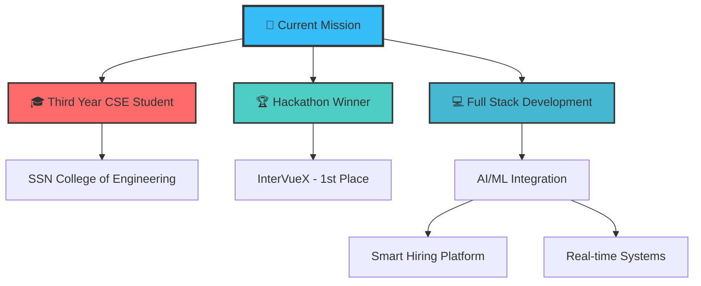
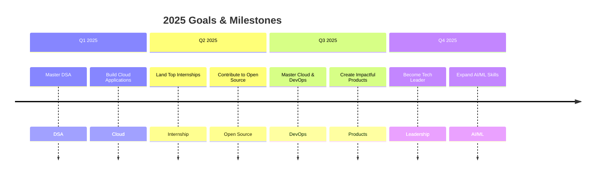
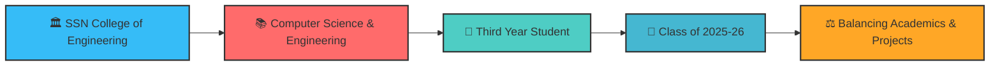

# 🚀 Ramcharan S | Full Stack Developer & AI/ML Enthusiast

<div align="center">

<!-- Enhanced animated banner with better styling -->


<!-- Improved typing banner with more dynamic content -->


<!-- Floating tech stack icons -->
<div style="display: flex; justify-content: center; gap: 20px; margin: 20px 0;">
  
  
  
  
</div>

</div>

---

## 🎯 **Mission Control**

<div align="center">



</div>

---

## 🧑‍💻 **About The Developer**

<div align="center">


</div>

<div align="left">

### 🎮 **Developer Profile Card**

```json
{
  "name": "Ramcharan S",
  "title": "Full Stack Developer & AI/ML Enthusiast",
  "education": "Third Year CSE Student at SSN College",
  "location": "Chennai, India 🇮🇳",
  "achievement": "🏆 1st Place Winner at InnovateX Hackathon 2025",
  "currentFocus": ["Web Development", "Cloud & DevOps", "DSA"],
  "domains": ["Smart Hiring", "Education", "Freelancing", "Gaming"],
  "passion": "Combining AI/ML with Interactive Design and Game Mechanics",
  "funFact": "Built first project (Course Registration System) in C using Raylib!",
  "superpower": "Turning complex problems into elegant solutions 💡"
}
```

### 🎯 **Key Highlights**

- 🎓 **Third Year CSE Student** at **Sri Sivasubramaniya Nadar (SSN) College of Engineering, Chennai**
- 🏆 **1st Place Winner** at InnovateX Hackathon 2025 for InterVueX
- 🔭 Currently focusing on **Web Development**, **Cloud & DevOps**, and **DSA** for upcoming internships
- 🌱 Building systems across domains: **Smart Hiring**, **Education**, **Freelancing** & **Gaming**
- 💡 Passionate about combining **AI/ML** with **Interactive Design** and **Game Mechanics**
- 👯 Looking to collaborate on **Full Stack Projects** and **Open Source Contributions**
- 📫 How to reach me: **ramcharan2310608@ssn.edu.in**

</div>

---

## ⚡ **Tech Arsenal - Level Up!**

<div align="center">

### 🎯 **Skill Tree**

<details>
<summary><b>💻 Programming Languages</b></summary>
<br>
<table>
<tr>
<td align="center" width="96">

<br>Python
</td>
<td align="center" width="96">

<br>JavaScript
</td>
<td align="center" width="96">

<br>Java
</td>
<td align="center" width="96">

<br>C++
</td>
<td align="center" width="96">

<br>C
</td>
<td align="center" width="96">

<br>C#
</td>
</tr>
</table>
</details>

<details>
<summary><b>🎨 Frontend Technologies</b></summary>
<br>
<table>
<tr>
<td align="center" width="96">

<br>React.js
</td>
<td align="center" width="96">

<br>HTML5
</td>
<td align="center" width="96">

<br>CSS3
</td>
<td align="center" width="96">

<br>Tailwind CSS
</td>
</tr>
</table>
</details>

<details>
<summary><b>⚙️ Backend Technologies</b></summary>
<br>
<table>
<tr>
<td align="center" width="96">

<br>Node.js
</td>
<td align="center" width="96">

<br>Express.js
</td>
<td align="center" width="96">

<br>Spring Boot
</td>
<td align="center" width="96">

<br>Flask
</td>
</tr>
</table>
</details>

<details>
<summary><b>📱 Mobile Development</b></summary>
<br>
<table>
<tr>
<td align="center" width="96">

<br>React Native
</td>
<td align="center" width="96">

<br>Flutter
</td>
</tr>
</table>
</details>

<details>
<summary><b>🗄️ Databases</b></summary>
<br>
<table>
<tr>
<td align="center" width="96">

<br>MongoDB
</td>
<td align="center" width="96">

<br>MySQL
</td>
<td align="center" width="96">

<br>Oracle
</td>
</tr>
</table>
</details>

<details>
<summary><b>🎮 Game/Graphics Development</b></summary>
<br>
<table>
<tr>
<td align="center" width="96">

<br>Unity
</td>
<td align="center" width="96">

<br>Raylib
</td>
</tr>
</table>
</details>

<details>
<summary><b>🔧 Development Tools</b></summary>
<br>
<table>
<tr>
<td align="center" width="96">

<br>VS Code
</td>
<td align="center" width="96">

<br>IntelliJ IDEA
</td>
<td align="center" width="96">

<br>Git
</td>
<td align="center" width="96">

<br>Postman
</td>
</tr>
</table>
</details>

</div>

---

## 🔥 **GitHub Analytics & Consistency**

<div align="center">

### 📊 **My Coding Journey**

<div style="display: flex; justify-content: center; gap: 20px; flex-wrap: wrap; margin: 20px 0;">
  
  
</div>

### 🏆 **GitHub Streak & Trophies**


### 📈 **Activity Timeline**


### 📅 **Contribution Calendar**


</div>

---

## 🏆 **Featured Projects Showcase**

<div align="center">

### 🎯 **InterVueX - Smart Hiring Platform** 
*🏆 1st Place Winner at InnovateX Hackathon 2025*

<div style="display: flex; justify-content: center; gap: 15px; flex-wrap: wrap; margin: 20px 0;">
  
  
  
  
</div>

**A comprehensive hiring platform that transforms recruitment with AI-powered features:**
- 🤖 Resume-based question generation
- 😊 Real-time sentiment analysis during interviews
- 📊 Rubric-based scoring system
- 🎥 Seamless video interviews via Jitsi integration
- 📈 Interactive dashboards for candidates and interviewers

---

### 📚 **Peer Learn - P2P Learning Platform** 
*React + Spring Boot*

<div style="display: flex; justify-content: center; gap: 15px; flex-wrap: wrap; margin: 20px 0;">
  
  
</div>

**An innovative peer-to-peer academic collaboration platform that:**
- 🤝 Connects students to share knowledge
- ⚡ Facilitates real-time collaboration
- 🌟 Creates a community-driven learning environment

---

### 💼 **Freelancing Platform (Prototype)**
*React + Flask + MongoDB*

<div style="display: flex; justify-content: center; gap: 15px; flex-wrap: wrap; margin: 20px 0;">
  
  
  
</div>

**A gamified freelancing ecosystem with:**
- 🏆 League-based rankings for freelancers
- 🔒 Escrow-backed milestone verification
- 🎯 Dynamic gig browsing and recommendation system

---

### 🕹️ **Real-Time Multiplayer Game**
*React + Flask-SocketIO*

<div style="display: flex; justify-content: center; gap: 15px; flex-wrap: wrap; margin: 20px 0;">
  
  
</div>

**A prototype multiplayer game featuring:**
- 🎮 Player state synchronization
- 🔄 WebSocket communication
- ⚡ Real-time interaction mechanics

---

### 🍽️ **FoodByte - Food Inventory & Wastage Tracker**
*React + Node.js*

<div style="display: flex; justify-content: center; gap: 15px; flex-wrap: wrap; margin: 20px 0;">
  
  
</div>

**A system to reduce food wastage by:**
- 📊 Monitoring institutional inventory
- 📈 Analyzing consumption patterns
- 🎯 Optimizing food ordering and usage

---

### 🏫 **Course Registration System**
*C + Raylib*

<div style="display: flex; justify-content: center; gap: 15px; flex-wrap: wrap; margin: 20px 0;">
  
  
</div>

**My first project! A university course registration system built from scratch using:**
- 💻 C programming fundamentals
- 🎨 Graphical interfaces with Raylib
- 🗄️ Database storage and retrieval concepts

</div>

---

## 🎯 **Current Focus & Roadmap**

<div align="center">



### 🚀 **Current Focus Areas**

```javascript
const ramcharan = {
    education: "Third Year CSE @ SSN College of Engineering, Chennai",
    currentFocus: ["Web Development Skills", "Cloud & DevOps", "DSA for Internships"],
    techStack: {
        main: ["MERN Stack", "Spring Boot", "Flask"],
        mobile: ["React Native", "Flutter"],
        exploring: ["AWS", "Docker", "Kubernetes"]
    },
    strengths: ["Full Stack Development", "Problem Solving", "Quick Learning", "System Design"],
    interests: ["AI/ML Integration", "Real-time Systems", "Game Mechanics", "Interactive Design"],
    goals: {
        shortTerm: ["Master DSA", "Build cloud-native applications", "Land top internships"],
        longTerm: ["Create impactful products", "Contribute to open source", "Become a versatile tech leader"]
    }
};
```

</div>

---

## 🎮 **Fun Zone**

<div align="center">


### 🎲 **Random Developer Facts**

<details>
<summary><b>Click to reveal a random fact about me! 🎯</b></summary>
<br>

- 🎮 I built my first project (Course Registration System) in C using Raylib!
- 🏆 Won 1st place at InnovateX Hackathon 2025 with InterVueX
- 💡 I can debug complex systems while designing game mechanics
- 🎯 My code quality improves when I'm solving real-world problems
- 🌟 I'm most productive when building systems that make a difference
- 🎓 Balancing academics with practical project development

</details>

</div>

---

## 🌐 **Connect & Collaborate**

<div align="center">

### 📱 **Let's Build Something Amazing Together!**

<div style="display: flex; justify-content: center; gap: 15px; flex-wrap: wrap; margin: 20px 0;">

[](www.linkedin.com/in/ramcharan-s-30506628a)
[](mailto:ramcharan2310608@ssn.edu.in)
[](https://ramcharan-portfolio.vercel.app)
[](https://github.com/Ramcharan-Swaminathan)

</div>

</div>

---

## 💡 **Daily Dose of Wisdom**

<div align="center">


</div>

---

## 🎓 **Academic Journey**

<div align="center">



</div>

---

## 🚀 **Call to Action**

<div align="center">


### ⭐ **Ready to Create Impact Together!**

<div style="display: flex; justify-content: center; gap: 20px; flex-wrap: wrap; margin: 20px 0;">

<a href="mailto:ramcharan2310608@ssn.edu.in">
  
</a>
<a href="www.linkedin.com/in/ramcharan-s-30506628a">
  
</a>

</div>

**💼 Open for Summer 2025 & 26 Internships | Full Stack & Cloud Development Roles**

**⭐ Star my repositories if you find them interesting!**

**🌟 Let's turn your ideas into reality!**

</div>

---

<div align="center">


</div>

---

<div align="center">

```ascii
╔══════════════════════════════════════════════════════════════════════════════╗
║                                                                              ║
║  🚀 THANKS FOR VISITING MY DIGITAL UNIVERSE! 🚀                            ║
║                                                                              ║
║  ┌─┐┌─┐┌┬┐┌─┐  ┬┌─┐  ┌─┐┌─┐┌─┐┌┬┐┬─┐┬ ┬  ┌─┐┌─┐┌─┐┌─┐┌─┐┌─┐┌─┐┌─┐        ║
║  │  │ │ ││├┤   │└─┐  ├─┘│ │├┤  │ ├┬┘└┬┘  │ ││ ││ ││ ││ ││ ││ ││ │        ║
║  └─┘└─┘─┴┘└─┘  ┴└─┘  ┴  └─┘└─┘ ┴ ┴└─ ┴   └─┘└─┘└─┘└─┘└─┘└─┘└─┘└─┘        ║
║                                                                              ║
║              💻 Happy Coding! Keep Building! 💻                            ║
║                                                                              ║
║  "The best way to predict the future is to invent it." - Alan Kay          ║
║                                                                              ║
║  -- Designed with ❤️ by Ramcharan S --                                     ║
╚══════════════════════════════════════════════════════════════════════════════╝
```

</div>
